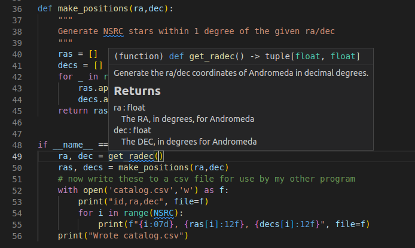

# Documentation
To avoid simulating the entire python interpreter in our minds, it is often easier to document the (intended) behavior of our code in a human readable format.

Python offers the builtin function `help()` to display the documentation for a given function.
Let's try that now.
> ## Challenge: Get some help
>
> Get some help on the python builtin function `open`
>
> 
> ~~~
> help(open)
> ~~~
> {: .language-python}
>
> > ## Solution
> >
> > 
> > ~~~
> > Help on built-in function open in module io:
> > 
> > open(file, mode='r', buffering=-1, encoding=None, errors=None, newline=None, closefd=True, opener=None)
> >     Open file and return a stream.  Raise OSError upon failure.
> >     
> >     file is either a text or byte string giving the name (and the path
> >     if the file isn't in the current working directory) of the file to
> >     be opened or an integer file descriptor of the file to be
> >     wrapped. (If a file descriptor is given, it is closed when the
> >     returned I/O object is closed, unless closefd is set to False.)
> >     
> >     mode is an optional string that specifies the mode in which the file
> >     is opened. It defaults to 'r' which means open for reading in text
> >     mode.  Other common values are 'w' for writing (truncating the file if
> >     it already exists), 'x' for creating and writing to a new file, and
> >     'a' for appending (which on some Unix systems, means that all writes
> >     append to the end of the file regardless of the current seek position).
> >     In text mode, if encoding is not specified the encoding used is platform
> >     dependent: locale.getpreferredencoding(False) is called to get the
> >     current locale encoding. (For reading and writing raw bytes use binary
> >     mode and leave encoding unspecified.) The available modes are:
> > ...
> > ~~~
> > {: .output}
> {: .solution}
{: .challenge}

Where does `help()` get all this information from?

In part, the information provided by help is part of the *docstring* for the `open` function.
We can view the docstring by viewing the `__doc__` attribute of the function as follows:

> ## Example
> ~~~
> print(open.__doc__)
> ~~~
> {: .language-python}
> > ## Output
> > ~~~
> > Open file and return a stream.  Raise OSError upon failure.
> > 
> > file is either a text or byte string giving the name (and the path
> > if the file isn't in the current working directory) of the file to
> > be opened or an integer file descriptor of the file to be
> > wrapped. (If a file descriptor is given, it is closed when the
> > returned I/O object is closed, unless closefd is set to False.)
> > 
> > mode is an optional string that specifies the mode in which the file
> > is opened. It defaults to 'r' which means open for reading in text
> > mode.  Other common values are 'w' for writing (truncating the file if
> > it already exists), 'x' for creating and writing to a new file, and
> > 'a' for appending (which on some Unix systems, means that all writes
> > append to the end of the file regardless of the current seek position).
> > In text mode, if encoding is not specified the encoding used is platform
> > dependent: locale.getpreferredencoding(False) is called to get the
> > current locale encoding. (For reading and writing raw bytes use binary
> > mode and leave encoding unspecified.) The available modes are:
> > ...
> > ~~~
> > {: .output}
> {: .solution}
{: .challenge}

Compare the help shown above to the official python documentation [here](https://docs.python.org/3/library/functions.html#open).

When we get to the [IDE episode]({{page.root}}), we'll see some more places that this help text shows up.

## Documentation vs commenting
There are two ways in which you can and should describe your code - documentation and commenting.
These two ways of describing code have two audiences (which may overlap) - documentation is for the people who will **use** your code, whilst comments are for people who will **develop** your code.
Both of these audiences include you, the original developer, some 6 months in the future when you have forgotten all the details about what you were doing.
Quite simply:

> Documentation is a love letter that you write to your future self.
>
> -- Damian Conway
{: .quote}

## Comments
Comments should include design decisions, or explanations of difficult to interpret code chunks.
Comments can include known/expected bugs or shortcomings in the code.
Things that are not yet implemented, or hacks that deal with bugs in other modules, should also be in comments.
Comments are also a good place to reference where you saw a particular idea/approach or even code that you have copied:
~~~
def very_smart_function():
    # This function is a modified version of <stackoverflow perma link>
    ...
    return
~~~
{: .language-python}

Python comments come in two flavours: a single or part line comment which begins with a `#`, or a multiline comment which is any string literal.

~~~

'''
A comment that covers more than one line
because it is just soooooo long
'''

def my_func(num):
  # assume that num is some numeric type, or at the very least
  # an object which supports division against an integer
  ans = num / 2 # A partial line comment
  return ans
~~~
{: .language-python}

The partial-line comment plus multi-line commands can be used to great effect when defining functions, dictionaries, or lists:
~~~
dict = {'key1': 0, # note about this item
        'key2': 1, # another note
        }

def my_func(num,
            ax,            # a matplotlib axes object
            verbose=True,  # TODO update to be logger.isEnabledFor(logging.DEBUG)
            **kwargs):
    ...
    return
~~~
{: .language-python}

When python is interpreted (or compiled to byte-code), the interpreter will *ignore* the comments.
The comments therefore only exist in the source code.
Commenting your code has no effect on the behavior of your code, but it will (hopefully) increase your ability to understand what you did.
(Remember: Clarity is important).
Because the comments are ignored by the python interpreter only people with access to your source code will read them (developer usually), so this is a bad place to describe how your code should be *used*.
For notes about code *usage* we instead use documentation.

## Docstrings
Python provides a way for us to document the code inline, using [docstrings](https://www.python.org/dev/peps/pep-0257/).
Docstrings can be attached to functions, classes, or modules, and are defined using a simple syntax as follows:

> ## Example
> ~~~
> def my_func():
>   """
>   This is the doc-string for the function my_func.
>   I can type anything I like in here.
>   The only constraint is that I start and end with tripe quotes (' or ")
>   I can use multi-line strings like this, or just a single line string if I prefer.
>   """
>   ...
>   return
> ~~~
> {: .language-python}
{: .challenge}

Docstrings can be any valid string literal, meaning that they can be encased in either single or double quotes, but they need to be triple quoted.
Raw and unicode strings are also fine.

Docstrings can be included anywhere in your code, however unless they immediately follow the beginning of a file (for modules) or the definition of a class or function, they will be ignored by the compiler (treated as a comment).
The docstrings which are defined at the start of a module/class/function will be saved to the `__doc__` attribute of that object, and can be accessed by normal python [introspection](http://en.wikipedia.org/wiki/Type_introspection).

### Docstring formats
While it is possible to include any information in any format within a docstring it is clearly better to have some consistency in the formatting.
(Remember: Clarity is important)

There are, unfortunately, many 'standard' formats for python documentation, though they are all similarly human readable so the difference between the formats is mostly about consistency and automated documentation.

Scipy, Numpy, and astropy, all use the [numpydoc](https://numpydoc.readthedocs.io/en/latest/format.html) format which is particularly easy to read.
We will be working with the numpydoc format in this workshop.

Let's have a look at an extensive example from the numpydoc website.

> ## example.py
> ~~~
> """Docstring for the example.py module.
> 
> Modules names should have short, all-lowercase names.  The module name may
> have underscores if this improves readability.
> 
> Every module should have a docstring at the very top of the file.  The
> module's docstring may extend over multiple lines.  If your docstring does
> extend over multiple lines, the closing three quotation marks must be on
> a line by itself, preferably preceded by a blank line.
> 
> """
> from __future__ import division, absolute_import, print_function
> 
> import os  # standard library imports first
> 
> # Do NOT import using *, e.g. from numpy import *
> #
> # Import the module using
> #
> #   import numpy
> #
> # instead or import individual functions as needed, e.g
> #
> #  from numpy import array, zeros
> #
> # If you prefer the use of abbreviated module names, we suggest the
> # convention used by NumPy itself::
> 
> import numpy as np
> import matplotlib as mpl
> import matplotlib.pyplot as plt
> 
> # These abbreviated names are not to be used in docstrings; users must
> # be able to paste and execute docstrings after importing only the
> # numpy module itself, unabbreviated.
> 
> 
> def foo(var1, var2, *args, long_var_name='hi', **kwargs):
>     r"""Summarize the function in one line.
> 
>     Several sentences providing an extended description. Refer to
>     variables using back-ticks, e.g. `var`.
> 
>     Parameters
>     ----------
>     var1 : array_like
>         Array_like means all those objects -- lists, nested lists, etc. --
>         that can be converted to an array.  We can also refer to
>         variables like `var1`.
>     var2 : int
>         The type above can either refer to an actual Python type
>         (e.g. ``int``), or describe the type of the variable in more
>         detail, e.g. ``(N,) ndarray`` or ``array_like``.
>     *args : iterable
>         Other arguments.
>     long_var_name : {'hi', 'ho'}, optional
>         Choices in brackets, default first when optional.
>     **kwargs : dict
>         Keyword arguments.
> 
>     Returns
>     -------
>     type
>         Explanation of anonymous return value of type ``type``.
>     describe : type
>         Explanation of return value named `describe`.
>     out : type
>         Explanation of `out`.
>     type_without_description
> 
>     Other Parameters
>     ----------------
>     only_seldom_used_keywords : type
>         Explanation.
>     common_parameters_listed_above : type
>         Explanation.
> 
>     Raises
>     ------
>     BadException
>         Because you shouldn't have done that.
> 
>     See Also
>     --------
>     numpy.array : Relationship (optional).
>     numpy.ndarray : Relationship (optional), which could be fairly long, in
>                     which case the line wraps here.
>     numpy.dot, numpy.linalg.norm, numpy.eye
> 
>     Notes
>     -----
>     Notes about the implementation algorithm (if needed).
> 
>     This can have multiple paragraphs.
> 
>     You may include some math:
> 
>     .. math:: X(e^{j\omega } ) = x(n)e^{ - j\omega n}
> 
>     And even use a Greek symbol like :math:`\omega` inline.
> 
>     References
>     ----------
>     Cite the relevant literature, e.g. [1]_.  You may also cite these
>     references in the notes section above.
> 
>     .. [1] O. McNoleg, "The integration of GIS, remote sensing,
>        expert systems and adaptive co-kriging for environmental habitat
>        modelling of the Highland Haggis using object-oriented, fuzzy-logic
>        and neural-network techniques," Computers & Geosciences, vol. 22,
>        pp. 585-588, 1996.
> 
>     Examples
>     --------
>     These are written in doctest format, and should illustrate how to
>     use the function.
> 
>     >>> a = [1, 2, 3]
>     >>> print([x + 3 for x in a])
>     [4, 5, 6]
>     >>> print("a\nb")
>     a
>     b
>     """
>     # After closing class docstring, there should be one blank line to
>     # separate following codes (according to PEP257).
>     # But for function, method and module, there should be no blank lines
>     # after closing the docstring.
>     pass
> ~~~
> {: .language-python}
{: .solution}

The example above is intentionally extensive, but you should be able to see what is going on. 
There are a few parts to the documentation format, some of which are considered essential, good practice, or optional.

### Essential documentation
The main goal of documentation is to describe the desired behavior or intended use of the code.
As such every docstring should contain at least a one line statement that shows the intent of the code.

> ## Document get_radec v1
> For our `get_radec` function that we created earlier, add a few lines of documentation to describe the intent of the function.
>
> `git commit` your changes when you are happy with them
> > ## (partial) Solution
> > ~~~
> > def get_radec():
> >     """
> >     Generate the ra/dec coordinates of Andromeda
> >     in decimal degrees.
> >     """
> >     # from wikipedia
> >     andromeda_ra = '00:42:44.3'
> >     andromeda_dec = '41:16:09'
> > 
> >     d, m, s = andromeda_dec.split(':')
> >     dec = int(d)+int(m)/60+float(s)/3600
> > 
> >     h, m, s = andromeda_ra.split(':')
> >     ra = 15*(int(h)+int(m)/60+float(s)/3600)
> >     ra = ra/math.cos(dec*math.pi/180)
> >     return ra,dec
> > ~~~
> > {: .language-python}
> {: .solution}
{: .challenge}

### Good practice documentation
It is good practice to describe the expected input and output (or behavior) of your functions.

In the numpydoc format we put these into two sections: 
- Parameters: for the input
- Returns: for the output

There is no "Modifies" section for the documentation (though you could add one if you like).
If the function modifies an input but does not return the modified version as an output then this should be included as part of the long form description.

> ## Document get_radec v2
> Extend our documentation for `get_radec` so that it includes a Returns section.
>
> `git commit` your changes when you are happy with them
> > ## Solution
> > ~~~
> > def get_radec():
> >     """
> >     Generate the ra/dec coordinates of Andromeda
> >     in decimal degrees.
> > 
> >     Returns
> >     -------
> >     ra : float
> >         The RA, in degrees, for Andromeda
> >     dec : float
> >         The DEC, in degrees for Andromeda
> >     """
> >     # from wikipedia
> >     andromeda_ra = '00:42:44.3'
> >     andromeda_dec = '41:16:09'
> > 
> >     d, m, s = andromeda_dec.split(':')
> >     dec = int(d)+int(m)/60+float(s)/3600
> > 
> >     h, m, s = andromeda_ra.split(':')
> >     ra = 15*(int(h)+int(m)/60+float(s)/3600)
> >     ra = ra/math.cos(dec*math.pi/180)
> >     return ra,dec
> > ~~~
> > {: .language-python}
> {: .solution}
{: .challenge}

### Optional documentation
The type of errors that are raised, and under what conditions, can be documented in the `Raises` section.

`Notes`, `References`, and `Examples`, are also useful sections but not usually applicable to all functions or classes that you will be writing.
If I have used code snippets from stack-overflow or similar, then I find `Notes`/`References` section to be a good place to acknowledge and link to those resources.

The `Examples` section can be used to show intended use.
There is an automated testing suite called [doctest](https://docs.python.org/3/library/doctest.html) which will scan your docstrings looking for segments starting with `>>>` and then run those segments in an interactive python interpreter.
A solid test suite will typically contain many tests for a single function, thus trying to embed all the tests into your docstrings just makes for very long docstrings.
It is preferable to keep your testing code in the `tests` module/directory of your python module (see the episode on [testing]({{page.root}})), and to use the `Examples` section only for demonstrating functionality to the end user.

## Making use of documentation
Some IDEs (the good ones) provide syntax highlighting, linting, and inline help as you write code.
By providing docstrings for all your functions you can make use of the linting and inline help.
Below is an example from [VSCode](https://code.visualstudio.com/) in which the docstring for a function is being shown to me as I code.

You can use the help from the python console like this:
~~~
Python 3.8.10 (default, Jun  2 2021, 10:49:15) 
[GCC 9.4.0] on linux
Type "help", "copyright", "credits" or "license" for more information.
>>> from sky_sim import get_radec
>>> help(radec)
Help on function get_radec in module poc_styled:

get_radec()
    Generate the ra/dec coordinates of Andromeda
    in decimal degrees.
    
    Returns
    -------
    ra : float
        The RA, in degrees, for Andromeda
    dec : float
        The DEC, in degrees for Andromeda
>>> 
~~~

Additionally you can compile all the documentation into a website or other document using an automated documentation tool as described in the next section.

## Automated Documentation
If your docstrings are formatted in a regular way then you can make use of an automated documentation tool.
There are many such tools available with a range of sophistication.

The simplest to use is the `pdoc` package which can be obtained from [pypi.org](https://pypi.org/project/pdoc/).

> ## Install and use pdoc
> Install the pdoc module and then run it on our documented code using:
> ~~~
> pip install pdoc
> pdoc ./mymodule/sky_sim.py
> ~~~
> {: .language-bash}
>
> By default pdoc will start a mini web sever with the documentation on it.
> This should be opened in your browser by default but if it isn't you can navigate to `localhost:8080` or `127.0.0.1:8080`.
> Use `<ctrl>+C` when you want to stop the web server.
> 
> Have an explore of the documentation so far and see how your docstring(s) map onto what is being shown on the web-pages.
{: .challenge}

To make documentation that is less ephemeral you can use the the `-o docs` option to cause all the documentation to be built and then placed into the `docs` folder.
`pdoc` only supports `html` output, however other auto-documentation packages such as [sphinx](https://www.sphinx-doc.org/en/master/) can write latex (and thus pdf), ePub, man pages, or plain text.

If you have automatically generated documentation then it you can set up a link between your github repo and a [read the docs ](rtfd.io) site.
See their [tutorial](https://docs.readthedocs.io/en/stable/tutorial/) on how to do this.

## Other forms of documentation

Compiling all your docstrings into an easy to find and navigate website is great, but this typically does not do a good job of documenting your software project as a whole.
In fact this is more like describing a public API.
What is required here is something that deals with the intent of the software, a description of the problem that it is solving, and how users can install and begin to use the software.
For this you have a few options:
- a `README.md` in your repository
- a user guide document (html or PDF)
- a wiki or [rtfd.io](https://www.readthedocs.org) style website

Within any of the above you would want to include things such as:
- a guide for downloading/compiling/installing your software
- a 'quick-start' guide or set of examples for new users
- a Frequently Asked Questions (FAQ) section to address common problems
- tutorials to demonstrate some of the key features of your software (Jupyter notebooks are great here)

GitHub and GitLab both provide a wiki for each repository.
Additionally both platforms will allow you to set up Continuous Integration (CI) tools that will automatically build and publish your documentation to a third party website.

> ## your github repo wiki is also a repo
> - If you have a github repository at https://github.com/[user]/[repo].git, then you can clone the wiki corresponding to that repository from https://github.com/[user]/[repo].wiki.git
> - The wiki uses markdown formatting to render the pages.
> - You can of course still use the online editor to update the wiki, which is nice, because it has a 'preview' button.
{: .callout}

## CLI and `--help`

Consider creating a command line interface (CLI) for your code and providing an option of `--help` that gives users a quick intro to the use of your code.

For example we could add a CLI to our `sky_sim` script as follows:

~~~
import argparse

...

def skysim_parser():
    """
    Configure the argparse for skysim

    Returns
    -------
    parser : argparse.ArgumentParser
        The parser for skysim.
    """
    parser = argparse.ArgumentParser(prog='sky_sim', prefix_chars='-')
    parser.add_argument('--ra', dest = 'ra', type=float, default=None,
                        help="Central ra (degrees) for the simulation location")
    parser.add_argument('--dec', dest = 'dec', type=float, default=None,
                        help="Central dec (degrees) for the simulation location")
    parser.add_argument('--out', dest='out', type=str, default='catalog.csv',
                        help='destination for the output catalog')
    return parser

if __name__ == "__main__":
    parser = skysim_parser()
    options = parser.parse_args()
    # if ra/dec are not supplied the use a default value
    if None in [options.ra, options.dec]:
        ra, dec = get_radec()
    else:
        ra = options.ra
        dec = options.dec
    
    ras, decs = make_stars(ra,dec)
    # now write these to a csv file for use by my other program
    with open(options.out,'w') as f:
        print("id,ra,dec", file=f)
        for i in range(NSRC):
            print(f"{i:07d}, {ras[i]:12f}, {decs[i]:12f}", file=f)
    print(f"Wrote {options.out}")
~~~
{: .language-python}

With this in place we can test running the code with a few different options, including `--help` which is added by default.

> ## Make a CLI
> - Copy or adapt the example above to create a CLI for your `sky_sim` script.
> - Test that it works by running it with a few different combinations of ra/dec/out
> - Use the [etherpad]({{site.ether_pad}}) to suggest one more option that you might add to this CLI. (No need to implement it).
> 
> When you are happy with your code commit the changes to your repo.
{: .challenge}